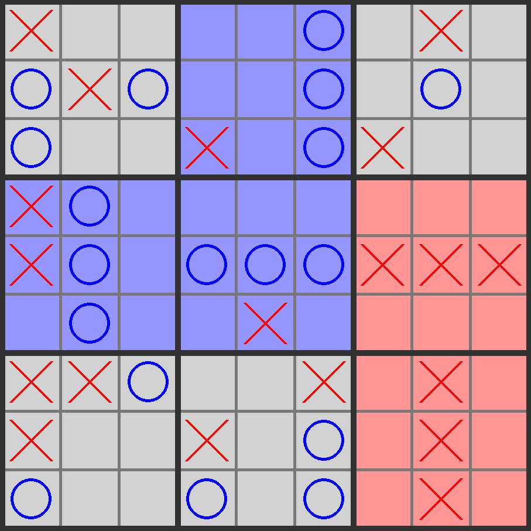

# Mega-Morpion (Ultimate Tic-Tac-Toe)

## Français
### Introduction

Ce projet constitue mon sujet de TIPE (dont le thème de cette année est "Jeux et sports") dans le cadre de ma CPGE. (2023-2024)

Le sujet que j'ai choisi est donc celui d'essayer de trouver le meilleur jeu possible, et le plus performant pour gagner au Méga-Morpion.
#### Objectif du projet

Tester plusieurs algorithmes de résolution de jeu, et examiner leurs performances et leurs résultats, en ajustant les paramètres et dans la limite des capacités de mon ordinateur.
### Règles du jeu

#### Interface
Nous avons une grille de morpion, où chaque case est un morpion.

#### Objectif
Gagner le Grand morpion (règles du morpion classique pour gagner).

#### Comment obtenir une grande case ?
Il faut gagner le morpion de cette grande case.

#### Où avons nous le droit de jouer à notre tour ?
* Premier joueur : joue là où il veut.

* Ensuite, selon le tour d'avant : 

    L'adversaire a joué dans la grande case **i**, dans sa petite case **j**
    * Si la grande case j a déjà été gagnée ou qu'elle est entièrement remplie, jouer n'importe où sur toute la grille
    * sinon, le joueur choisit de jouer nimporte où dans la grande case **j**

### Algorithmes

* MinMax 
* AlphaBeta
* Recherche arborescante Monte-Carlo (MCTS) (pas sûre)

## English
### Introduction

This project is part of my academic program in preparatory classes for higher education (CPGE) during the 2023-2024 academic year. 
CPGE is a preparatory track in France aiming to prepare students for entrance exams into top-tier higher engineering education institutions. 
This project, is a personal research project focused on the 'Games and Sports' theme of the year. 

My objective is to discover the most effective winning strategy for Mega Tic-Tac-Toe.
#### Project Objective

Test several game-solving algorithms, and examine their performance and results by adjusting the parameters within the limits of my computer's capabilities.
### Game Rules

#### Interface
We have a big Tic-Tac-Toe grid, where each cell is a Tic-Tac-Toe grid.

#### Objective
Win the large Tic-Tac-Toe (the rules to win are the same as the regular Tic-Tac-Toe).

#### How to get a big cell?
You need to win the Tic-Tac-Toe grid within that big cell.

#### Where are we allowed to play on our turn?
* First player: plays wherever they want.

* Then, according to the previous turn: 

    The opponent played in the big cell **i**, in their small cell **j**
    * If the big cell j has already been won or is fully filled, play anywhere on the entire grid.
    * Otherwise, the player chooses to play anywhere in the big cell **j**.

### Algorithms

* MinMax 
* AlphaBeta
* Monte-Carlo Tree Search (MCTS) (not sure)
